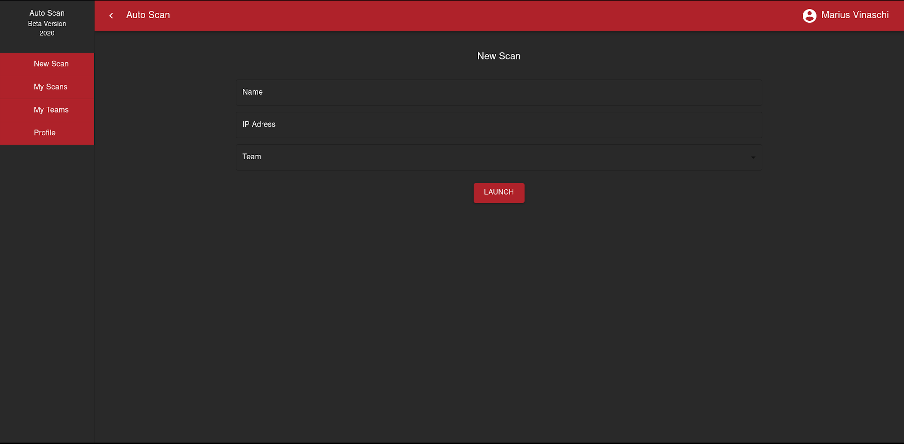
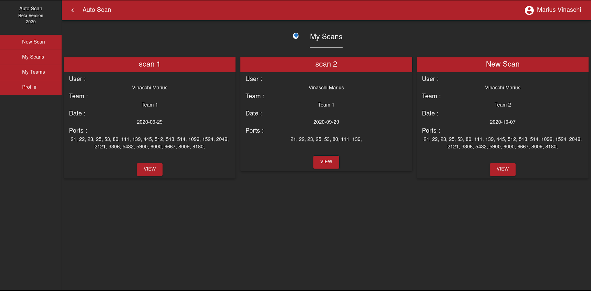
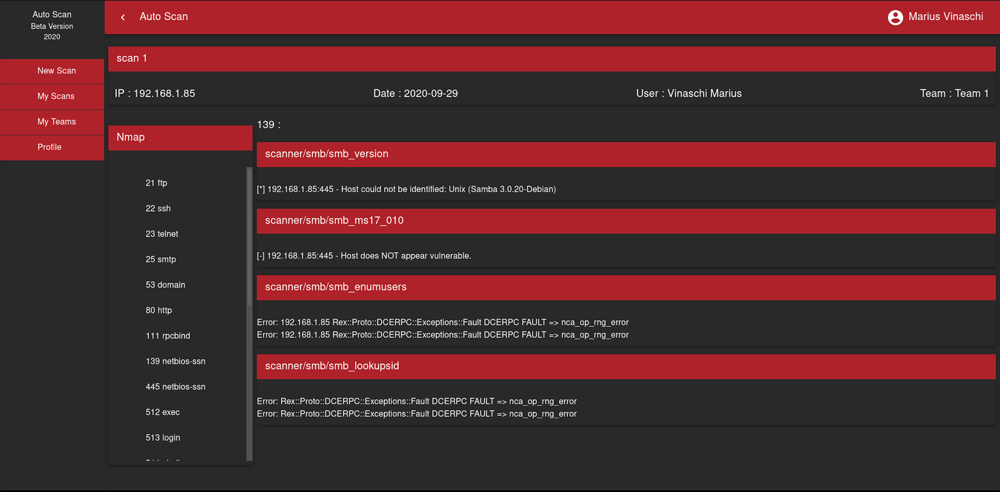

# Auto Scan 

AutoScan is a WebApp that uses FlaskAPI/FastAPI and MongoDB. This app will start several tools to pentest Active Directory. The results will be shown on the WebApp.

## Interface :  

Start a new scan



See all the scans



See the results for one scan



## Built With :

#### Frontend : 
We created the interface with React Typescript and Material-UI. 
#### API :
The API was created with Flask : 
* flask-restful to encourage best practices
* pymetasploit3 to use Metasploit
* nmap3 to use Nmap 
* marshmallow to check the Input
* flask-pymongo to store the result 
* flask-jwt-extended to create Token
#### Database :
We use MongoDB to stock the results. 
#### Tools :
We use several tools : 
* Nmap 
* Responder 
* John 
* SMBMAP 
* CrackMapExec
* Impacket 

## Install 

```
git clone https://github.com/MariusVinaschi/Auto-Scan.git
cd Auto-Scan 
docker-compose up -d                                                                   
```

Open your browser and search : http://localhost:3000


## Correction 

Need: 
* Make some correction and Review 
* Responder doesn't work in docker 
